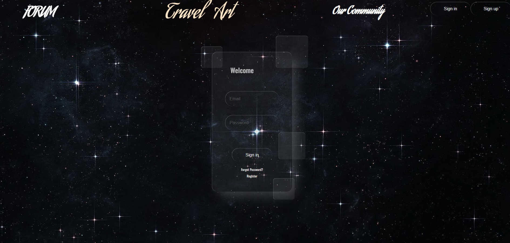
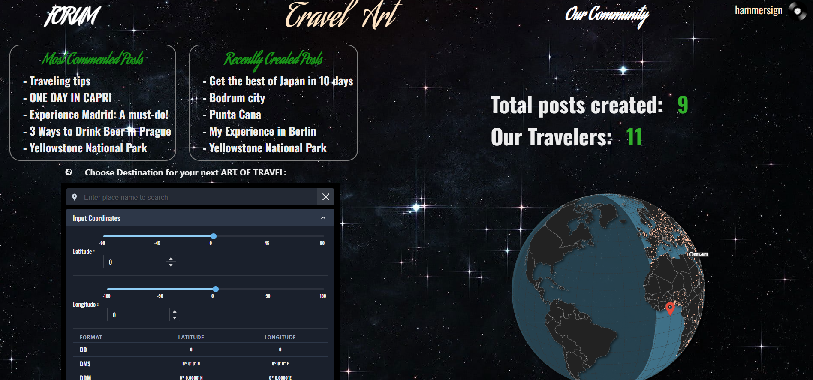
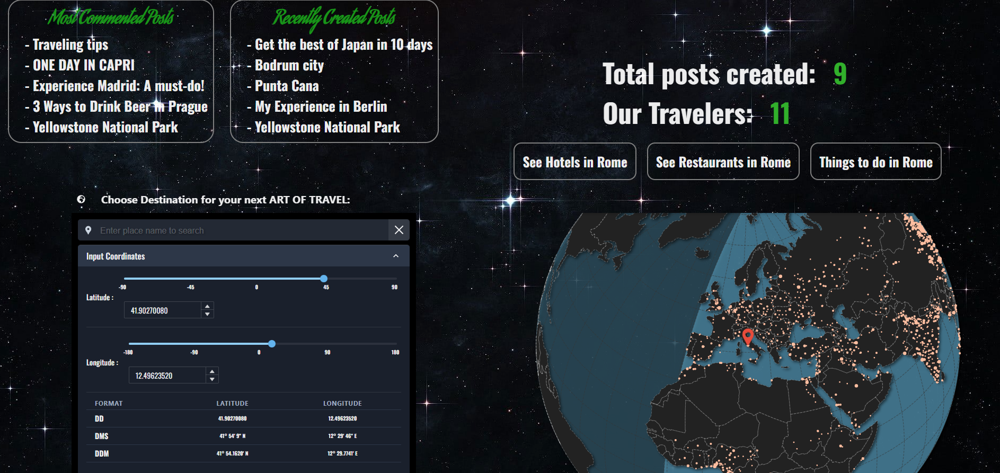
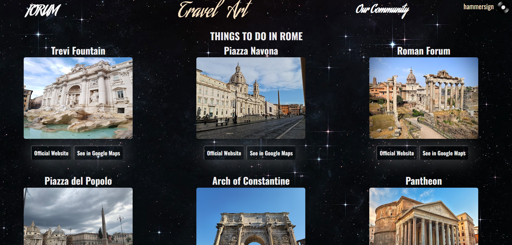
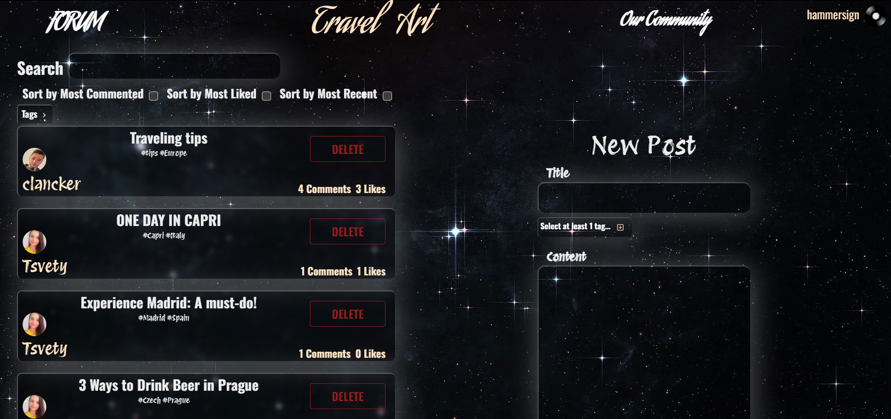
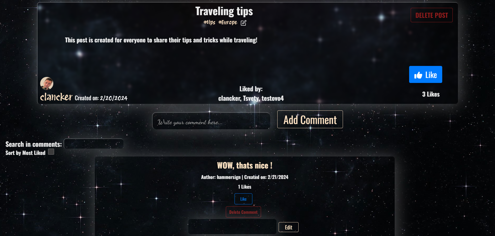

# Travel-Art

## Description

Travel Art SPA application for every travel lover. The application is able to display tourist destinations, hotels, reviews from other users and more!

## Getting Started

To get started with Travel Art, follow these steps:

1. Clone the repository: `git clone https://github.com/JS-Masters/Travel-Art.git`
2. Install the required dependencies: `npm install`
3. Start the application: `npm start`
4. To enable the shearch functionality in 3D Globe you should:
- obtain a Google Maps API key and place it in this directory: /src/data/constants.js like this:
``` export const GOOGLE_API = 'YOUR_API_KEY'; ```
- uncomment the following in App.jsx :

```// import ResultsByCity from "./TRAVEL-ART-FORUM/components/ResultsByCity/ResultsByCity";```

```// <Route path="/hotels-by-city" element={<ResultsByCity criteria={"Hotels"} />}```

```// <Route path="/restaurants-by-city" element={<ResultsByCity criteria={"Restaurants"} />} />```

```// <Route path="/things-to-do-by-city" element={<ResultsByCity criteria={"Things to do"} />} />```

- unccoment the whole content of  ResultsByCity.jsx file.

## Features

Feature Summary:

- Intuitive and user-friendly interface for easy navigation.
- Validation for user and admin attributes. Public and private sections accessible with and without authentication.
- User profile management, including profile photo upload.
- Admin section accessible with administrative privileges that includes user search, blocking/unblocking users, promoting users to admin role, posts and comments deletion.


<br/>

- Users can interact with the application to discover new travel destinations and plan their stay. They can explore and find information about various travel spots, including information about the location, country specifics, and time zone. 

    
	<br/>

    
	<br/>

    
	<br/>


- A view with a list of all posts with sorting and filtering options. Implementation of tags for easier navigation.
- Creation, editing, and deletion of posts and comments, as well as, browsing, sorting, and filtering options.

    
    <br/>

- A single post view, including comments, replies and likes.
- Users can add, remove, and edit tags on their posts.

    
    <br/>


## Developed by:

Martin Stefanov, Mehmed Yunuz, Tsvetomila Stoilkova

3D Globe: SamSol (open-source)

## Contributing

If you have any ideas, suggestions, or bug reports, please open an issue or submit a pull request.

## License

Telerik Academy